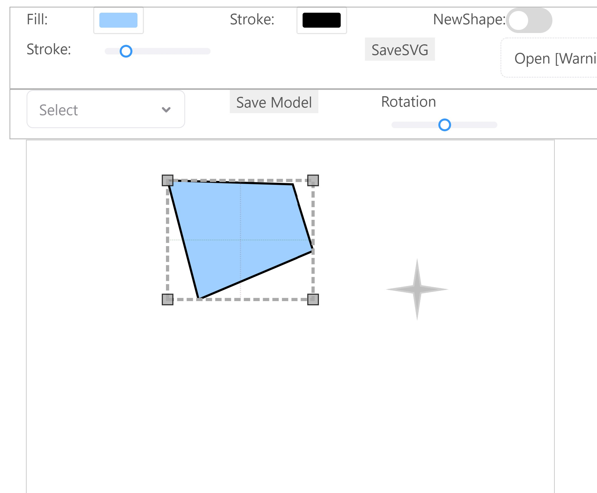
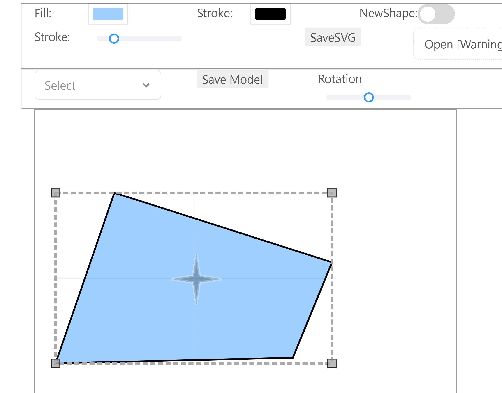
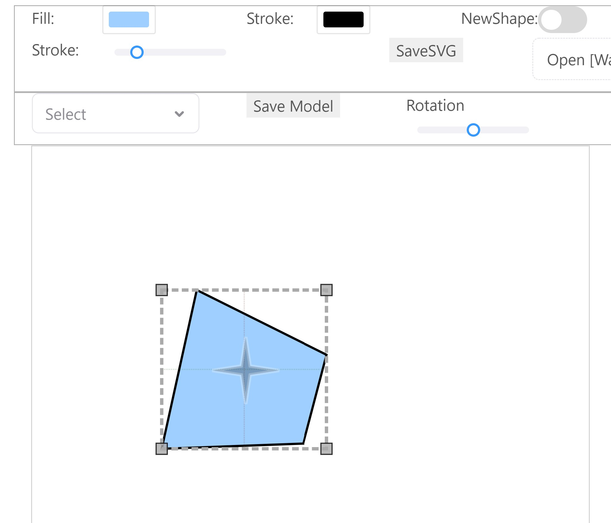

# Controllers

Controllers handle coordination between the model and view (classic MVC-style). 
The main difference in AniGraph is that controllers can form a graph structure, much like models.
The other function of controllers is managing interactions. You can define interactions in a controller 
(e.g., whenever someone clicks on the controller's view, log the message "clicked"), 
which can be activated or deactivated at different times. 

There is generally a 1-to-1 correspondence between regular controllers, models, and views. 
However, we can attach _supplemental controllers_ to existing controllers as a way to add additional functionality.
Supplemental controllers share the same model as their `hostController` (the controller they attach to).
They start listening to this model as soon as they are attached.

Example of supplemental controller:
Ever notice how, in most document editing software, when you click on an embedded image, a bounding box will often appear around it?
And if you click and drag on the corners of that bounding box, this will often resize the image. 
We're going to implement similar functionality in this assignment. 
The image in this case will be a vector shape you are drawing. 
The model for our shape will be an `A1Model`, which stores vertices and SVG attributes like fill color and line thickness.
The view will define how to draw a corresponding SVG image to display in your browser, 
and the controller will facilitate communication between these two.
When we click a shape, a supplemental controller for editing shapes will attach to that shape's controller.
Our supplemental controller will also have a supplemental view that renders the bounding box and its handles.
Since our supplemental controller listens to the same model as our regular controller, it will get updates whenever that model changes.
This means that if our model changes, our selection controller can adjust its view (which renders the object's bounding box) to compensate.

We will explain more in lecture.

# In this assignment
You will implement two supplemental controllers.

- `ATransformController`: This will let you move the object's anchor by dragging around the anchor graphic. It will also let you scale the object by dragging bounding box handles.
When you scale, it will resize the object around the object's own origin. The images below show 1) the anchor being moved and 2) the shape being scaled.

- `ATransformCenteredController`: This will be like `ATransformController`, but scaling will happen around the center of the object's own bounding box instead of the origin.

## Controller Example: `A1ScalePoorlyController.js`
Before starting, let's take a look at an example controller to see how to format things. Specifically, we will look at `A1ScalePoorlyController.js`: a controller that scales objects, well, poorly... In particular, it scales the object by directly manipulating their vertices. We'll talk about why this is a bad design further down below.

#### Controller super classes
`A1ScalePoorlyController` extends `A1Shape2DBoundingBoxController` which manages a `AShape2DBoundingBoxView`. The `AShape2DBoundingBoxView` renders a bounding box with handles at each of its corners, and a compass icon, which we call an anchor. `A1ScalePoorlyController`, as well as both of the controllers you will write for this assignment, each manage different interactions with bounding box handles or anchors.

The image below shows the bounding box around the shape and the anchor in the center. 

#### addInteractionsToHandle
As the name suggests, this function adds interactions to bounding box handles (corners).
The code creates a drag interaction, `iaction`, and gives it an appropriate name. Then, the model and the `this` variable, which points to the controller, are aliased so they can use inside of callbacks (using aliases like this is an alternative to binding functions).

This function defines three callback functions: `setDragStartCallback`, `setDragMoveCallback`, `setDragEndCallback`. These
three callbacks are called when the user clicks down on the handle, moves the handle (with the mouse pressed), and releases the click, respectively.

In our handle interaction, the user will drag a handle, which we will call simply call *handle*, to scale the shape around the opposite corner of the bounding box, which we will call *pivot*. The scaling should only occur when the user is moving the mouse during a drag interaction. Thus, most of the work is done in `setDragMoveCallback`.
However, in order to do this scaling, we need to store some information about our object's state at the start of the drag. We can store this information directly in the drag interaction
`iaction`. 

Finally, `setDragEndCallback` doesn't do much in this example, but you may want to execute code upon the end of the drag in your code. This may also depend on how you design it.

##### `setDragStartCallback`.
When a user clicks on a corner of a bounding box, no scaling occurs. However, information should be saved about the
initial state to use when the mouse is moved, scaling the object. 
- `startCursorPosition`. The first thing the code keeps track of is 
the coordinate of the mouse when pressed. Without this, it would be difficult to determine how to scale in
`setDragMoveCallback`. 
- `startVerts`. This controller scales by directly modifying the vertices and the
 scaling is all done relative to the initial positions, so the code keeps track of initial vertices. Again, this type of
 scaling is **bad** and should not be implemented in the controllers we ask you to write. 
- `startHandleLocation` and `startPivotLocation`. `startHandleLocation` is the location of the bounding box corner selected while `startPivotLocation` is the location of the opposite corner. Note that when scaling, this pivot
location never changes. Try scaling an object in powerpoint, the corner opposite the one you selected won't move. 
- `startDiagonal`. This is the vector from the pivot to the handle. Why is this needed?

##### `setDragMoveCallback`
This callback is called whenever the cursor is moved. This is where the scaling factor is calculated 
in the x- and y- direction. The vertices are then scaled by this factor. 

How is the scaling factor calculated? Since the scaling is done around the pivot, the scaling can be calculated
by looking at how the diagonal of the bounding box changes.  

- `newDiagonal`. To find the new diagonal, vector addition is used as shown in the code. 
- `scaleMat` The scaling factor in the x- and y- direction are used to create the corresponding scaling matrix.
- `newVerts` ScaleMat is applied to each vertex.

The controller will update the vertices to `newVerts` and also update the view. 

##### `setDragEndCallback`
Nothing needs to be updated or saved when we release the mouse. 

### Why `A1ScalePoorlyController.js` is a bad design:
So why is direct manipulation of vertices a bad way to implement scaling? Well, think about the extreme case where a user scales their shape vertically down to 0, turning it into a horizontal line. If our scale function manipulates vertices directly, there is no way to recover from this: our shape will turn into a bunch of colinear points! That may seem like a corner case, but it reflects a loss of precision that that will happen every time the shape is modified. In graphics applications, it's easy for these errors to accumulate. This can be disasterous, *especially* in the context of scientific computing.

## A Better way to Transform Objects
In this part of the assignment we will implement improved controllers that transform our objects' coordinate systems instead of modifying vertex data directly. Each object's coordinate system is represented by the matrix and matrix properties you implemented in `A1Model.js` (if you haven't done that yet, we suggest you start there). The two controllers you will implement are `A1TransformController` and `A1TransformCenteredController`.

Here's an overview of the code you should modify:

### A1TransformController
There are two functions in this controller: `addInteractionsToHandle` and `addInteractionsToAnchor`. 

#### addInteractionsToHandle
This function, like in `A1ScalePoorlyController` handles interactions with a bounding box handle. In this case, you will
be scaling around the origin of the object, represented by an anchor in the GUI. However, the scaling should **not** be done by modifying the vertices directly. Instead, the transformation matrix contained in the model should be updated to include this new scaling. Before coding, it would be best to 
understand this transformation graphically. Recall that we have the transformation matrix `M=ORST` that transforms 
object coordinates to world coordinates. Since this controller is dealing with scaling, in which coordinate system should
the scaling occur? To be more specific, where in this chain of transformations, ORST, should we deal with this new
scaling? 

Your main task in `setDragStartCallback` is:
- Save state in `iaction` about the initial state that you need to correctly scale later.

Your main tasks in `setDragMoveCallback` are:
- Calculate the scaling factor in the x- and y- direction. Note that you shouldn't use the "diagonal" between the pivot
and handle in `A1ScalePoorlyController` to calculate the ratio as we were scaling around the pivot of the bounding box.
You can calculate the scaling factor using the ratio between the new and old mouse coordinates. However, 
 what coordinate system should you calculate this scaling factor in?
- Update the transformation matrix to include this new scaling.

#### addInteractionsToAnchor
As mentioned above, this controller scales about the origin which is represented by an anchor in the GUI. If the
anchor is moved, the origin moves with it. This adds an extra translation of the origin that we need to account for. 
Like `addInteractionsToAnchor`, there are three callback functions but you only need to write code for the start and move
callback functions. Your two tasks are:
- Add information about the initial state in 
`setDragStartCallback`. 
- Use this information in `setDragMoveCallback` to set the origin and update the transformation matrix.

## A1TransformCenteredController
This controller is a subclass of`A1TransformController`. Instead of scaling around the origin, this controller
scales around the center of the bounding box. While much of the implementation is the same as in `A1TransformController`,
there are differences in "where" the transformation occurs. In what coordinate system should the scaling occur?
